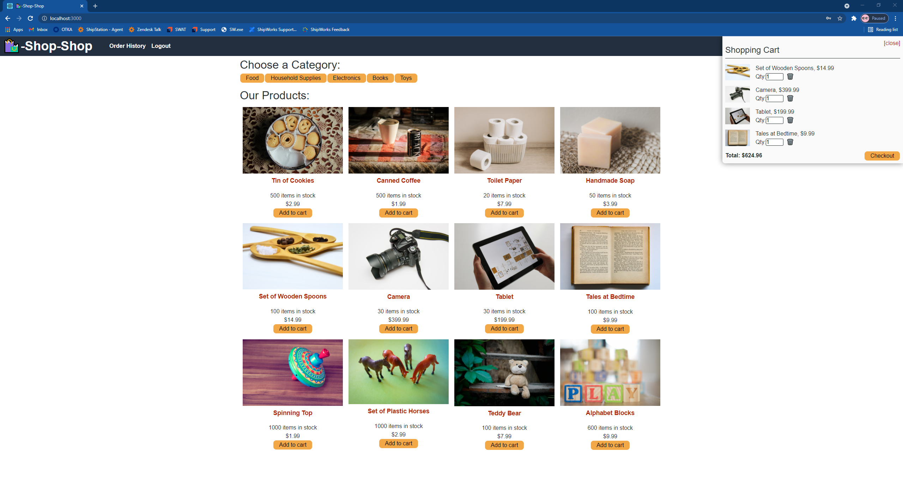

# Redux Store

## Description

## Table of Contents
* [Live Deployment](#live)
* [Installation](#installation)
* [Usage](#usage)
* [Technologies Used](#tech)
* [License](#license)

## Live Deployment

## Installation

*Steps required to install this project and get the application running:*
Clone repo, npm i to install all packages in client and server, npm run seed in server, npm start in server and client, application will run
on localhost:300 and api server on localhost:3001

## Usage
*Instructions for use:*
Signup or login on the top. Broswe through products and click on them to open information. Add them to cart with add to cart button, remove from cart with remove button. You can only checkout if youre logged in. Checkout takes you to stripe page to complete payment info.

## Tech

## License
MIT
Open
